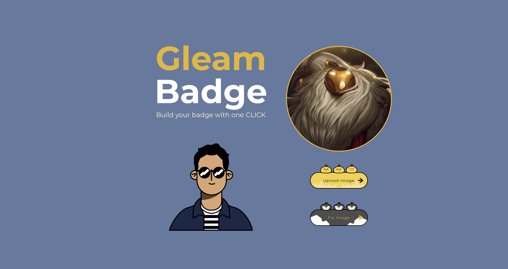

<div align="center">
  
  <div>&nbsp;</div>
  <div align="center">
    <b><font size="5">Gleam Badge</font></b>
    <sup>
      <a href="https://ElMehdijebbour.github.io/gleam_badge">
        <i><font size="4">Explore Now!</font></i>
      </a>
    </sup>
    &nbsp;&nbsp;&nbsp;&nbsp;

  </div>
  <div>&nbsp;</div>

[](https://your-docs-url)
[](https://reactjs.org/)
[](https://nodejs.org/)
[](https://github.com/your-username/your-repository-name/pulls)
[](https://opensource.org/licenses/MIT)

</div>

## Table of Contents

- [Table of Contents](#table-of-contents)
- [Getting Started 🚀](#getting-started-)
- [Color Palette](#color-palette)
- [Figma Design](#figma-design)
- [Installation](#installation)
- [Core Libraries](#core-libraries)
  - [Redux \& Redux Toolkit](#redux--redux-toolkit)
  - [Material-UI](#material-ui)
- [Folder Structure](#folder-structure)
- [Tests](#tests)
- [Docker Image](#docker-image)
- [Screenshots](#screenshots)

## Getting Started 🚀

Gleam Badge is a React application designed to create and manage digital badges.

## Color Palette

The application uses the following color palette:

- **#E8C872**
- **#FFF3CF**
- **#C9D7DD**
- **#637A9F**

For more details, refer to [Color Hunt](https://colorhunt.co/palette/e8c872fff3cfc9d7dd637a9f).

## Figma Design

You can find the Figma design for the gleam badge [here](https://www.figma.com/file/8fi0bIWF5Z3KIpW8CgxCuQ/Avatar-Maker-library-(Community)?type=design&node-id=0%3A1&mode=design&t=lHjKt9RaifqcqExB-1).


## Installation

To get started with Gleam Badge:

1. Clone the repository: `git clone https://github.com/ElMehdijebbour/gleam_badge`
2. Navigate into the project directory: `cd gleam_badge`
3. Install dependencies: `npm install`
4. Start the development server: `npm start`
5. Open `http://localhost:3000` in your browser to view the app.


## Core Libraries


### Redux & Redux Toolkit

Manages application state globally, facilitating easier state management and debugging.

### Material-UI

Provides a comprehensive set of UI tools and components that adhere to Material Design principles, allowing for the rapid development of a visually consistent interface.

## Folder Structure

Below is the folder structure for the Gleam Badge application:

```plaintext
src/
├── app/
│   ├── App.css
│   └── App.js
├── assets/
│   ├── base_avatar.png
│   ├── placeholder.png
│   ├── test.jpg
│   └── test.png
├── components/
│   ├── avatar/
│   │   ├── Avatar.css
│   │   └── Avatar.js
│   ├── buttons/
│   │   ├── Buttons.css
│   │   ├── FixImageButton.js
│   │   └── UploadButton.js
│   ├── image_upload/
│   │   ├── ImagePreview.js
│   │   ├── ImageUpload.css
│   │   └── ImageUpload.js
│   └── title/
│       ├── Title.css
│       └── Title.js
├── pages/
│   ├── BasicPage.css
│   └── BasicPage.js
├── tests/
│   └── UploadButton.test.js
├── utils/
│   ├── convertImageToObject.js
│   └── verifyImage.js
├── index.js
├── logo.svg
├── .gitignore
├── dockerfile
├── package-lock.json
├── package.json
├── README.md
```


## Tests

The application is thoroughly tested to ensure functionality and maintain code quality. Various types of tests are included, such as unit tests, integration tests, and end-to-end tests. These tests are essential for verifying the correctness of the application's behavior and detecting any regressions introduced during development.

To run the tests locally, you can use the following command:

```bash
$ npm test
```


## Docker Image

The application is containerized using Docker, allowing for easy deployment and scalability. You can build the Docker image using the provided Dockerfile.

To build the Docker image, navigate to the root directory of the project and run the following command:

```bash
$ docker build -t gleam_badge .

Once the Docker image is built, you can run it using the following command:

```
```bash
$ docker run -d -p 3000:8080 gleam_badge
```
## Screenshots

Below are some screenshots of the application:





